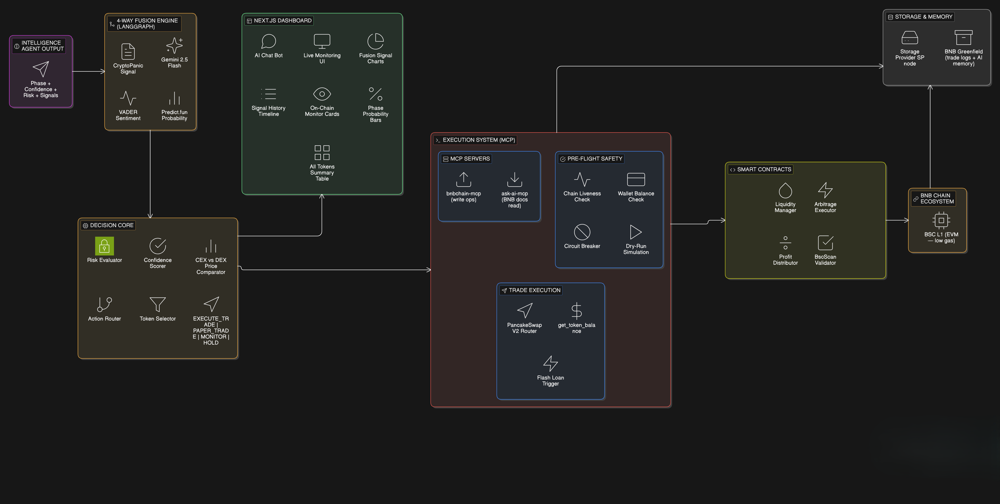
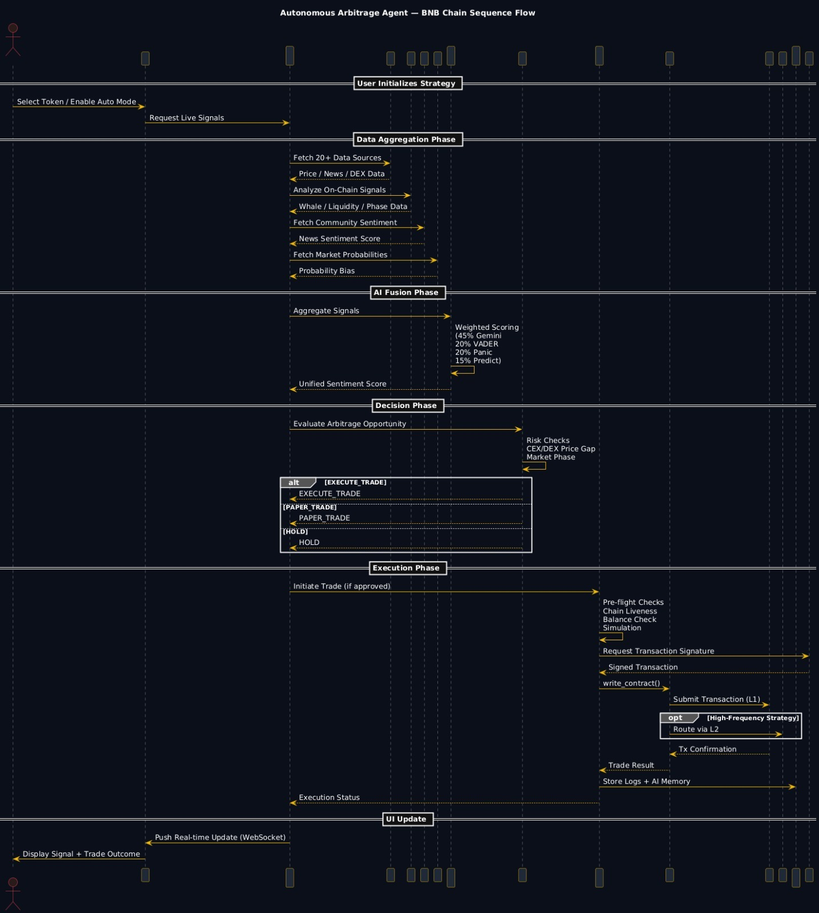

# Autonomous Arbitrage Agent on BNB Chain

**BSC · MCP-Powered · Multi-Agent Pipeline · On-chain Execution**

This project is an AI-powered arbitrage agent on the BNB Chain that analyzes:
- **Market data** 
- **News sources** 
- **On-chain activity** 
to identify high-probability arbitrage opportunities. 

It displays these insights through a dashboard equipped with a chatbot interface. This allows users to easily review the AI's findings and manually confirm trades. 

Once approved, the system automatically executes the transaction using Solidity smart contracts and a securely connected wallet—enabling a semi-automated, user-controlled, and highly transparent trading experience.

---

## Full Architecture 

### Data Intelligence Layer

### Infrastructure Layer(Frontend and Backend)

### Sequence Diagram

### Data Ingestion Agent 
- **Price Oracles**: Real-time token prices (CoinGecko OHLCV)
- **News & RSS Feeds**: Aggregates from GNews, TheNewsAPI, and multiple RSS feeds
- **Web Scraping**: Custom parsers for crypto forums 
- **Google Trends**: Search interest signals tracking retail momentum
- **DEX Aggregators**: Multi-DEX price feeds (PancakeSwap, Biswap, 1inch)
- **ask-ai-mcp**: Contextual RAG search across BNB Chain docs & BEPs

### On-Chain Intelligence Agent 
- **Buy/Sell Pressure**: Analyzes real-time volume
- **Whale Wallet Flows**: BscScan large transaction tracking
- **Social Growth Vel.**: Community momentum stats
- **Dev Activity**: GitHub commit parsing
- **Liquidity Changes**: DeFiLlama TVL shifts
- **Holder Distribution**: BscScan wallet distribution
- **Narrative Tracker & Phase Predictor**: NLP keywords predicting Accumulation, Momentum Building, Distribution, or Volatility Spikes

### 4-Way Fusion Analysis Agent
Fuses signals into a single confidence score using a LangGraph state-graph:
- ** Gemini 2.5 Flash (45%)**: Deep narrative analysis
- ** VADER (20%)**: Fast lexicon-based scoring
- ** CryptoPanic (20%)**: Community news sentiment
- ** Predict.fun (15%)**: Probabilistic forward bias

### Decision Agent
- Weighs fused 4-way sentiment against live CEX/DEX price disparities and market phase risk.
- Outputs one of three actions: `✅ EXECUTE_TRADE`, `📋 PAPER_TRADE`, or `⏸ HOLD`

### Execution Agent (MCP) + Smart Contracts
- Safely interfaces with the blockchain via **bnbchain-mcp** (@bnb-chain/mcp Node.js).
- **Pre-Flight Checks**: Chain liveness verify, Wallet balance check, Dry-run simulation.
- **Circuit Breaker**: Auto-pauses on consecutive failures to protect funds.
- **Execution**: Automates reads and writes to PancakeSwap V2 Router.
- Uses Solidity Smart Contracts for Flash-loan enabled trades, Liquidity Position Management, Validation, and Auto Profit Distribution.

### Blockchain — On-chain Settlement
- **BSC (L1)**: Main arb venue (PancakeSwap). EVM · ~3s blocks · Low gas.

---

## 🛠 Prerequisites

- Python 3.9+
- Node.js 18+ (for the BNBChain MCP server)
- A BSC Testnet wallet funded with tBNB — faucet: https://testnet.bnbchain.org/faucet-smart

